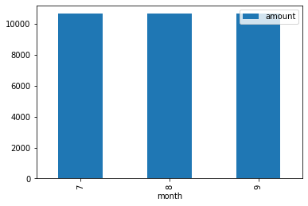

#FINANCIAL REPORT

##BUDGET ANALYSYS

##RETIREMENT PLANNER

1. What are the expected cumulative returns at 20 years for the 10th, 50th, and 90th percentiles?

Expected cumulative portfolio return at 30 years for the 10th percentile is 1.12.
Expected cumulative portfolio return at 30 years for the 50th percentile is 2.01.
Expected cumulative portfolio return at 30 years for the 90th percentile is 3.57.

2. Given an initial investment of $20,000, what is the expected return in dollars at the 10th, 50th, and 90th percentiles?

Expected portfolio return in dollars at the 10th percentile is $22420.07.

Expected portfolio return in dollars at the 50th percentile is $40252.36.

Expected portfolio return in dollars at the 90th percentile is $71495.39.

3. Given the current projected annual income from the Plaid analysis, will a 4% withdrawal rate meet or exceed that value at the 10th percentile? Note: This is basically determining if retirement income is equivalent to current income.

4% withdraw is not sufficient to cover the projected annual income

4. How would a 50% increase in the initial investment amount affect the 4% retirement withdrawal? In other words, what happens if the initial investment had been bigger?

4% withdraw is not sufficient to cover the projected annual income

